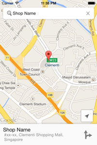
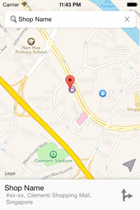
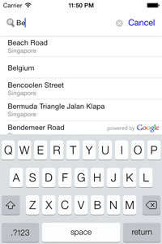
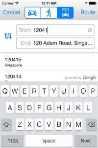
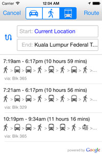
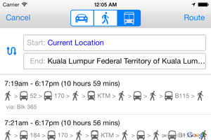
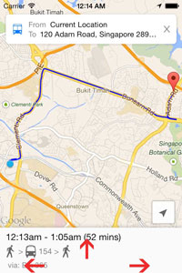
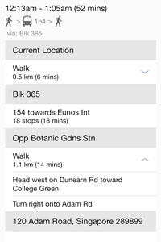
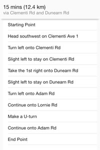

P2MSRoutingView (OnGoing)
===============

This project is inspired by Google Map application for IOS.

This is supposed to work on IOS 5+. 

Please be sure that [Google Maps SDK for IOS](https://developers.google.com/maps/documentation/ios/index) and [Google Places API](https://developers.google.com/places/documentation/) services are enabled in [Google Developer Console](https://code.google.com/apis/console) and API keys are generated properly.

*Follows the steps described in Google Map SDK for IOS [Getting Started](https://developers.google.com/maps/documentation/ios/start) guide to set up the new project*

Please carefully read  the [usage limits](https://developers.google.com/places/policies#usage_limits) for Places API.

>Everyone is invited to contribute to improve and add more features to this library

## Usage
Add the Google API Keys in "P2MSGoogleMapHelper.h" before running this sample.

	#define GOOGLEMAP_IOS_KEY @"add_your_key_here" //Key for iOS apps
	#define GOOGLEMAP_API_KEY @"add_your_key_here" //Key for API Access authenticaition

Loading mapView with predefined Place Name and Coordinate

    P2MSMapViewController *mapViewC = [[P2MSMapViewController alloc]initWithNibName:nil bundle:nil];
    mapViewC.locationNameToGo = @"Shop Name, #xx-xx, Clementi Shopping Mall,\n Singapore";
    mapViewC.locToGo = CLLocationCoordinate2DMake(1.315047,103.764752);
    mapViewC.mapType = MAP_TYPE_GOOGLE;// MAP_TYPE_GOOGLE (default), MAP_TYPE_APPLE
    

will result in

 

###Place AutoComplete & Geocode

*(will add custom data source or local source in later)*
### Query AutoComplete
 

### Driection
 

### Direction Detail
 

####Add/customize transit icons
**P2MSDirectionView.m**

	(UIImageView *)getImageViewForRoute:(NSArray *)routeComponent

####Customize Tracking Button for Apple Map
	P2MSUserTrackingButton.h
	P2MSUserTrackingButton.m

####Know Issue
- Memory warning in map rotation (from MKMapKit)

###Credits
- [Map Pins](http://allur.co/psd/map-markers-flags-pins-psd/) (http://allur.co/psd/map-markers-flags-pins-psd/)

###Contributions
- Contributions and suggestions are welcome.